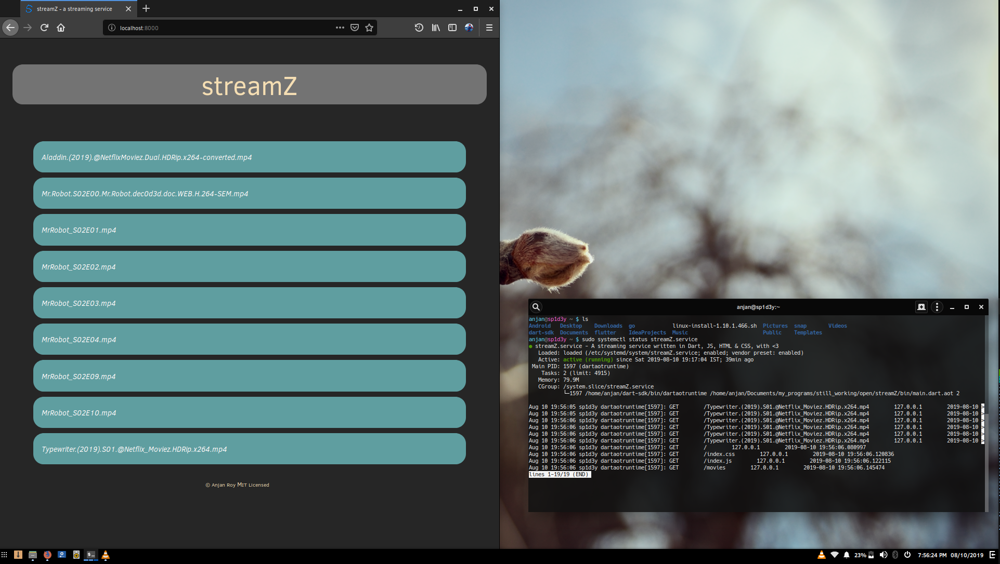
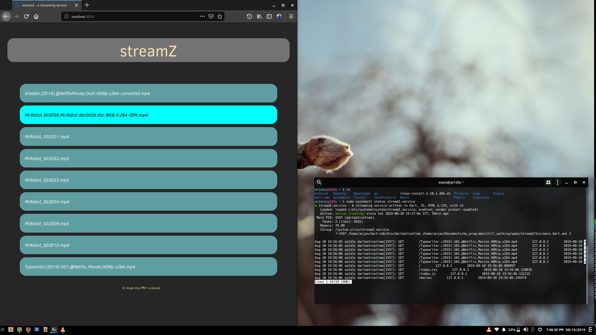
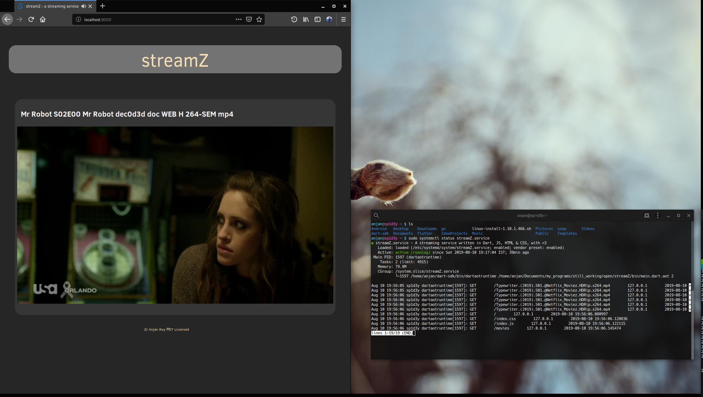

# streamZ
A simple video streaming application made with _Dart_, _JS_, _HTML_, _CSS_ & :heart: 

Show some :heart: by putting :star:

## what does it do ?
- A streaming service, intended to run in small network(s) _( may be in your home network )_, which lets you stream movies to any device present in that network & having a standard browser installed _( yeah HTML5 support required )_
- Backend, fully written in _Dart_, leveraging power of _dart:io_ & _dart:isolate_
- Frontend, powered by _HTML_, _CSS_ & last but not least _Javascript_ _( yeah not using any UI framework )_
- Audio-Video playing is done using HTML5 **\<video>** element, which can play _mp4_ & _webm_ video(s) generally
## how can I use it ?
- Simply fork this repo & clone it in you machine
- Make sure you've installed _Dart SDK_ & you're on _*nix_ platform
- Because I gonna use _systemd.service_ to keep this streaming service alive in background, always, even after system restarts it'll auto start itself
- You need to make sure, you've _~/Videos/_ directory present on your system, cause we'll read from that directory _( every 30 minutes )_, to ensure all _mp4_ & _webm_
videos, present in aforementioned directory, are listed in movie playlist
- Start streaming server, which will be available via port 8000
```shell script
$ cd bin # assuming you're already at root of project directory
$ dart main.dart
```
- Consider using _Ahead Of Time_-compiled version _( at production )_, for better performance
```shell script
$ dart2aot main.dart main.dart.aot // compilation
$ dartaotruntime main.dart.aot
```
- If you're having a lot of traffic, consider using multiple Isolates to handle traffic efficiently
```shell script
$ dartaotruntime main.dart.aot 2 // using two Isolates
$ dartaotruntime main.dart.aot n // using n Isolates, n >= 1
```
- Now you can simply use this streaming service by opening `http://ip-addr-server:8000/`, on any device's browser present in LAN
- For using service from same machine, simply use `http://localhost:8000/` from your favourite browser
- Deploying via _systemd.service_, to be explained in a blog post, to be published soon
## how does it look like ?






**Feel free to check source code to dig deeper _( it's pretty well documented )_**

Hope it helps ... :wink:
